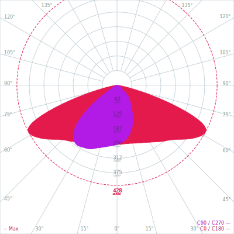

 
 

    <picture>
        <source media="(prefers-color-scheme: dark)"  width="400px" srcset="src/assets/images/logo/dark.png">
        
    </picture>

#

<h4 align="center">
    <strong>@xlsft/photon</strong> – IESNA:LM-63-2002 photometry files parser and SVG render engine
</h4>
 

    <picture>
        <source media="(prefers-color-scheme: dark)" srcset="https://i.imgur.com/CEBivQF.png">
        
    </picture>

---

<h2 id="start"><strong>📷 Available renders</strong></h2>

- Light fixture technical drawing
- Linear Luminous Intensity Distribution Curve **(Type C only!)**
- Polar Luminous Intensity Distribution Curve **(Type C only!)**
- Iso-candela plot (soon)
- Iso-illuminance plot (soon)
- BUG rating plot (soon)
- Beam intensities schema (soon)

---

<h2 id="start"><strong>⭐ Examples</strong></h2>

### Example 1

### Example 2

